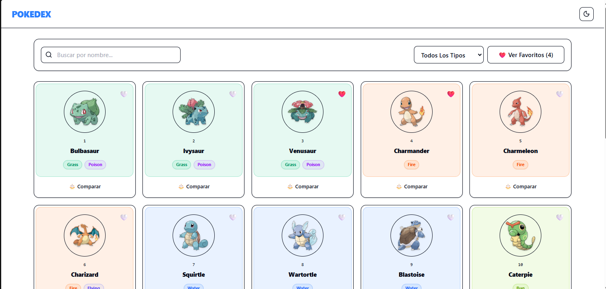
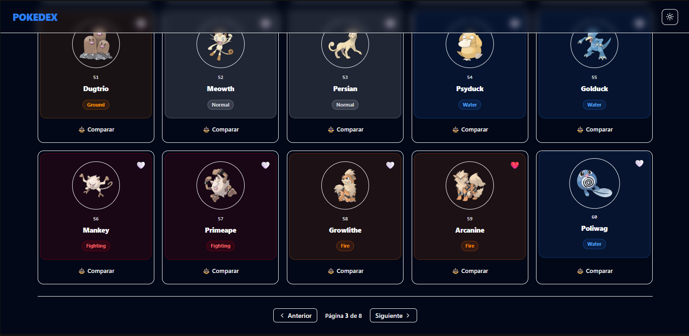
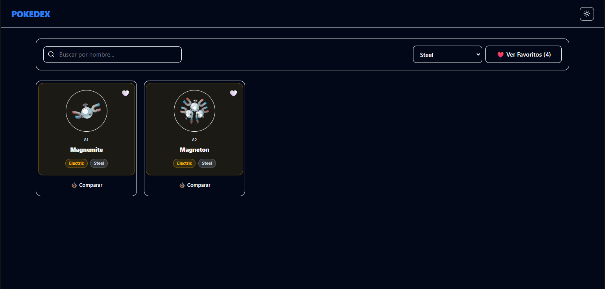
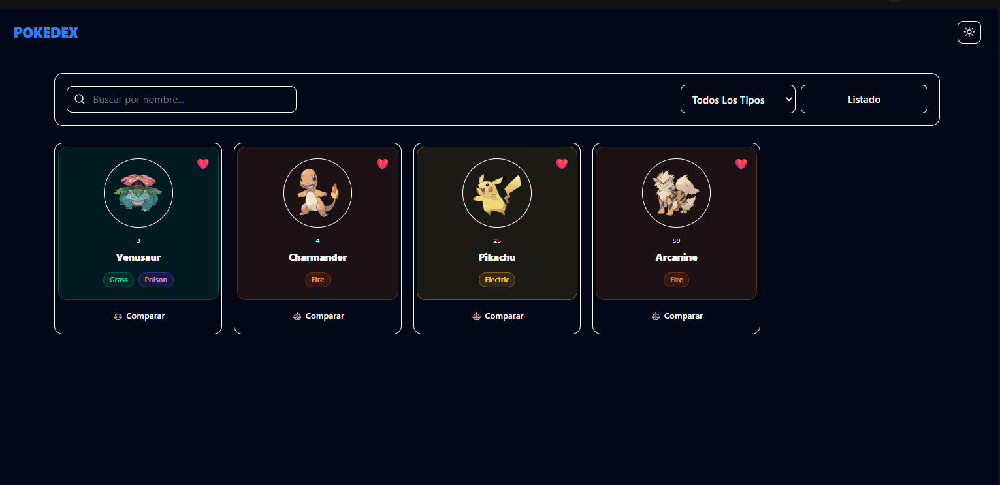
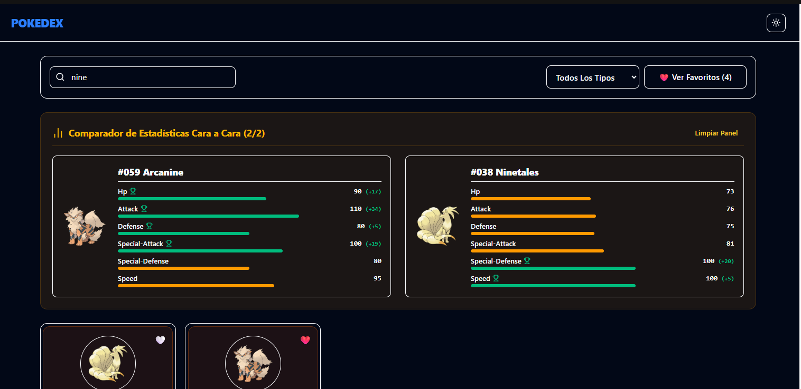
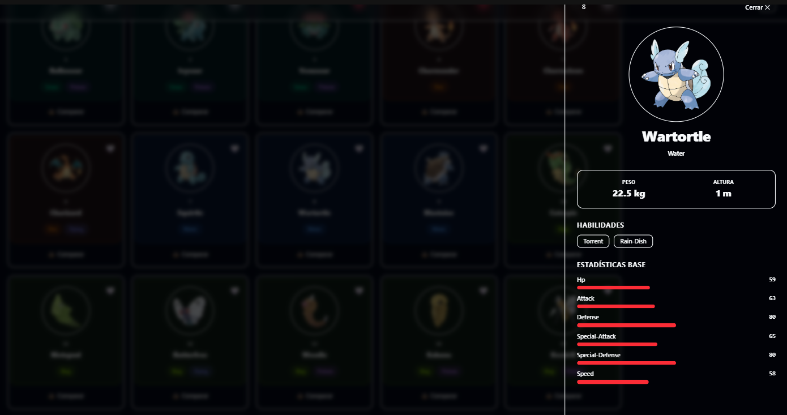
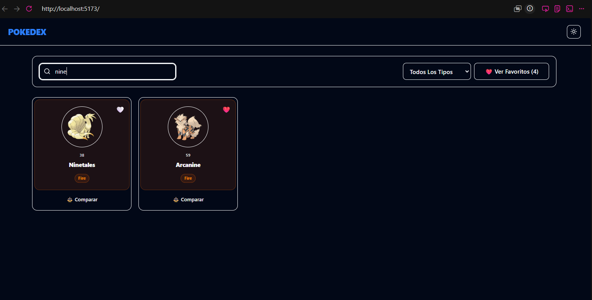
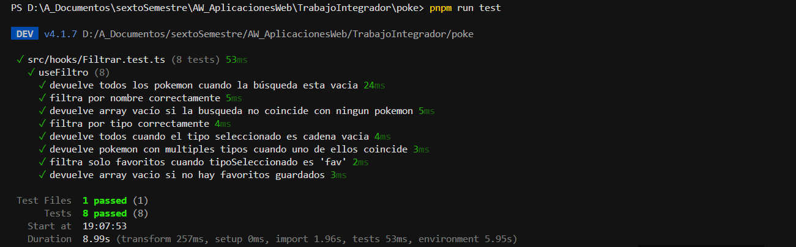

# Pokédex App

**Desarrolladora:** Alondra Judith Gonzalez Borbolla 

---

## Descripción

Aplicación web fullstack que consume la PokeAPI a través de un servidor proxy propio construido en NestJS. Permite explorar los 151 pokémon de la primera generación con funcionalidades de búsqueda, filtrado por tipo, favoritos, comparación y visualización de detalles. El frontend está construido en React con Vite y Tailwind CSS, y soporta modo oscuro con persistencia de preferencias.

---

## Tecnologías utilizadas

### Frontend
| Tecnología | Versión | Uso |
|---|---|---|
| React | 19.2.6 | Librería de UI |
| Vite | 8.0.12 | Bundler y servidor de desarrollo |
| TypeScript | 6.0.2 | Tipado estático |
| Tailwind CSS | 4.3.0 | Estilos utilitarios |
| shadcn/ui | — | Componentes base (Button, etc.) |
| Lucide React | 1.16.0 | Iconografía |
| Vitest | 4.1.7 | Pruebas unitarias |
| pnpm | — | Gestor de paquetes |

### Backend
| Tecnología | Versión | Uso |
|---|---|---|
| NestJS | 10+ | Framework del servidor proxy |
| @nestjs/axios | — | Cliente HTTP para consumir PokeAPI |
| @nestjs/cache-manager | — | Caché en memoria (TTL: 1 hora) |
| TypeScript | 5+ | Tipado estático |

### API externa
- [PokéAPI](https://pokeapi.co/) — fuente de datos de todos los Pokémon

---

## Instrucciones de instalación

### Requisitos previos
- Node.js 18 o superior
- pnpm (`npm install -g pnpm`)

### Backend (servidor proxy NestJS)

```bash
cd poke-back
pnpm install
pnpm run start:dev
```

El servidor quedará corriendo en `http://localhost:3000`.

### Frontend (React + Vite)

```bash
cd poke
pnpm install
pnpm dev
```

La app quedará disponible en `http://localhost:5173`.

> **Importante:** el backend debe estar corriendo antes de iniciar el frontend, ya que toda la comunicación con PokeAPI pasa por el proxy.

---

## Comandos para ejecutar el proyecto

```bash
# Backend
pnpm run start:dev     # desarrollo con hot-reload
pnpm run start:prod    # producción
pnpm run test          # pruebas unitarias (Jest)

# Frontend
pnpm dev               # desarrollo
pnpm build             # compilar para producción
pnpm preview           # previsualizar build
pnpm test              # pruebas unitarias (Vitest)
```

---

## Funcionalidades implementadas

- **Listado de 151 pokémon** — tarjetas con imagen oficial, nombre y tipos
- **Buscador en tiempo real** — filtra por nombre mientras escribes
- **Filtro por tipo** — menú desplegable con todos los tipos elementales
- **Favoritos** — agregar y quitar pokémon favoritos con persistencia en `localStorage`
- **Vista de favoritos** — filtrar para ver únicamente los pokémon guardados
- **Modal de detalle** — estadísticas completas, habilidades, altura y peso
- **Comparación** — seleccionar hasta 2 pokémon y comparar sus stats lado a lado
- **Paginación** — bloques de 20 pokémon con controles de navegación
- **Modo oscuro / claro** — toggle con persistencia de preferencia en `localStorage`
- **Servidor proxy con caché** — el backend guarda las respuestas de PokeAPI por 1 hora para evitar peticiones repetidas

---

## Pruebas unitarias

Las pruebas están ubicadas junto al código que prueban:

```
frontend/src/
└── hooks/
    ├── Filtrar.ts
    └── Filtrar.test.ts
```

Para correrlas:

```bash
cd poke
pnpm test
```

**Resultado: 8/8 pruebas pasando**

| # | Prueba |
|---|---|
| ✅ | Devuelve todos los pokémon cuando la búsqueda está vacía |
| ✅ | Filtra por nombre correctamente |
| ✅ | Devuelve array vacío si la búsqueda no coincide con ningún pokémon |
| ✅ | Filtra por tipo correctamente |
| ✅ | Devuelve todos cuando el tipo seleccionado es cadena vacía |
| ✅ | Devuelve pokémon con múltiples tipos cuando uno de ellos coincide |
| ✅ | Filtra solo favoritos cuando tipoSeleccionado es `'fav'` |
| ✅ | Devuelve array vacío si no hay favoritos guardados |

---

## Capturas de pantalla

### Listado principal — modo claro


### Paginación — modo oscuro


### Filtrado por tipo


### Vista de favoritos


### Comparación de estadísticas


### Modal de detalle


### Búsqueda en tiempo real


### Pruebas unitarias — 8/8 pasando


---

## Problemas encontrados y soluciones

### 1. Error 500 al cargar los 151 pokémon

**Problema:** El backend lanzaba todas las peticiones a PokeAPI de forma simultánea usando `Promise.all` con 151 promesas en paralelo. La PokeAPI aplicaba rate limiting y rechazaba las peticiones. Adicionalmente, el timeout configurado en NestJS era de solo 5 segundos, insuficiente para completar tantas peticiones.

**Solución:** Se implementó un sistema de procesamiento por lotes de 10 pokémon. El backend espera que cada lote termine antes de solicitar el siguiente, y el timeout se aumentó a 30 segundos.

```ts
// Antes — fallaba con rate limit
const resultados = await Promise.all(data.results.map(...));

// Después — lotes de 10
for (let i = 0; i < data.results.length; i += 10) {
  const lote = data.results.slice(i, i + 10);
  const detallesLote = await Promise.all(lote.map(...));
  resultados.push(...detallesLote);
}
```

### 2. Lógica mezclada en App.tsx

**Problema:** Todo el estado y la lógica de la aplicación vivía en un solo componente, haciéndolo difícil de leer, mantener y probar.

**Solución:** Se extrajo la lógica en hooks personalizados con responsabilidad única: `Filtrar`, `ModoOscuro`, `Favoritos`, `Paginacion` y `Comparacion`. `App.tsx` quedo conectando todo.

### 3. Paginación que no reseteaba al filtrar

**Problema:** Al cambiar el filtro de tipo o la búsqueda estando en una página avanzada, la app mostraba una página vacía porque el índice no volvía a 1.

**Solución:** Se agregó un `useEffect` en `Paginacion` que observa los valores de búsqueda y tipo, y resetea `paginaActual` a 1 cada vez que cambian.

```ts
useEffect(() => {
  setPaginaActual(1);
}, [busqueda, tipoSeleccionado]);
```

### 4. Error de tipos en vite.config.ts al configurar Vitest

**Problema:** Al agregar la sección `test` en `vite.config.ts`, TypeScript marcaba error porque `defineConfig` de Vite no incluye los tipos de Vitest.

**Solución:** Cambiar el import de `defineConfig` para que venga de `vitest/config` en lugar de `vite`.

```ts
// Antes
import { defineConfig } from 'vite'

// Después
import { defineConfig } from 'vitest/config'
```
